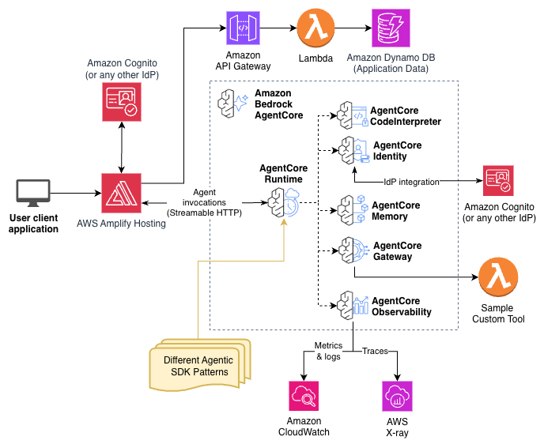

# Fullstack AgentCore Solution Template (FAST)

_Author's note: for the official name for this solution is the "Fullstack Solution Template for Agentcore" but it is referred to throughout this code base as FAST for convenience._

The Fullstack AgentCore Solution Template (FAST) is a starter project repository that enables users (delivery scientists and engineers) to quickly deploy a secured, web-accessible React frontend connected to an AgentCore backend. Its purpose is to accelerate building full stack applications on AgentCore from weeks to days by handling the undifferentiated heavy lifting of infrastructure setup and to enable vibe-coding style development on top. The only central dependency of FAST is AgentCore. It is agnostic to agent SDK (Strands, LangGraph, etc) and to coding assistant platforms (Q, Kiro, Cline, Claude Code, etc).

FAST is designed with security and vibe-codability as primary tenets. Best practices and knowledge from experts are codified in _documentation_ in this repository rather than in _code_. By including this documentation in an AI coding assistant's context, or by instructing the AI coding assistant to leverage best practices and code snippets found in the documentation, delivery scientists and developers can quickly vibe-build AgentCore applications for any use case. AI coding assistants can be used to fully customize the frontend and the infrastructure, enabling scientists to focus the areas where their knowledge is most impactful: the actual prompt engineering and GenAI implementation details.

With FAST as a starting point and development framework, delivery scientists and engineers will accelerate their development process and deliver production quality AgentCore code following architecture and security best practices without having to learn any frontend or infrastructure code.

## FAST Baseline System

FAST comes deployable out-of-the-box with a fully functioning, full-stack application. This application represents starts as a basic multi-turn chat agent where the backend agent has access to tools. **Do not let this deter you, even if your use case is entirely different! If your application requires AgentCore, customizing FAST to any use case is extremely straightforward. That is the intended use of FAST!**

The application is intentionally kept very, very simple to allow developers to easily build up whatever they want on top of the baseline. The tools shipped out of the box include:

1. **Gateway Tools** - Lambda-based tools behind AgentCore Gateway with authentication:
   - Text analysis tool (counts words and letter frequency)
   
2. **Code Interpreter** - Direct integration with Amazon Bedrock AgentCore Code Interpreter:
   - Secure Python code execution in isolated sandbox
   - Session management with state persistence
   - Pre-built runtime with common libraries

Try asking the agent to analyze text or execute Python code to see these tools in action.


## FAST User Setup

If you are a delivery scientist or engineer who wants to use FAST to build a full stack application, this is the section for you.

FAST is designed to be forked and deployed out of the box with a security-approved baseline system working. Your task will be to customize it to create your own full stack application to to do (literally) anything on AgentCore.

Deploying the full stack out-of-the-box FAST baseline system is only a few cdk commands once you have forked the repo, namely: 

```bash
cd infra-cdk
npm install
cdk bootstrap # Once ever
cdk deploy
cd ..
python scripts/deploy-frontend.py
```

See the [deployment guide](docs/DEPLOYMENT.md) for detailed instructions on how to deploy FAST into an AWS account.

> **Terraform alternative:** FAST also supports Terraform for infrastructure deployment. See [`infra-terraform/README.md`](infra-terraform/README.md) for the Terraform deployment guide. We recommend choosing one infrastructure tool and deleting the other directory (`infra-cdk/` or `infra-terraform/`) from your fork to keep things clean.

What comes next? That's up to you, the developer. With your requirements in mind, open up your coding assistant, describe what you'd like to do, and begin. The steering docs in this repository help guide coding assistants with best practices, and encourage them to always refer to the documentation built-in to the repository to make sure you end up building something great.

## Architecture



The out-of-the-box architecture is shown above. The diagram illustrates the authentication flows across the stack:
1. User login to the frontend (Cognito User Pool — Authorization Code grant): The user authenticates with Cognito via the web application hosted on AWS Amplify. Cognito issues a JWT access token for the session.
2. Frontend to AgentCore Runtime (Cognito User Pool JWT validation): The frontend passes the user's JWT in the Authorization header. The Runtime validates the token against the Cognito User Pool.
3. AgentCore Runtime to AgentCore Gateway (OAuth2 Client Credentials / M2M): The Runtime authenticates as a service using the OAuth2 Client Credentials grant — independent of the user's identity. AgentCore Identity manages token retrieval via the Token Vault.
4. Frontend to API Gateway (Cognito User Pool JWT validation): API requests are authenticated using a Cognito User Pools Authorizer with the same user JWT from Flow 1.

### Tech Stack

- **Frontend**: React with TypeScript, Vite, Tailwind CSS, and shadcn components - infinitely flexible and ready for coding assistants
- **Agent Providers**: Multiple agent providers supported (Strands, LangGraph, etc.) running within AgentCore Runtime
- **Authentication**: AWS Cognito User Pool with OAuth support for easy swapping out Cognito
- **Infrastructure**: CDK deployment with Amplify Hosting for frontend and AgentCore backend ([Terraform also supported](infra-terraform/README.md))

## Project Structure

```
fullstack-agentcore-solution-template/
├── .amazonq/               # Amazon Q assistant rules
├── .github/                # GitHub Actions workflows
│   └── workflows/
├── docker/                 # Docker development environment
│   ├── docker-compose.yml  # Local development stack
│   └── Dockerfile.frontend.dev # Frontend development container
├── frontend/               # React frontend application
│   ├── src/
│   │   ├── app/            # Application pages
│   │   ├── components/     # React components (shadcn/ui)
│   │   ├── hooks/          # Custom React hooks
│   │   ├── lib/            # Utility libraries
│   │   │   └── agentcore-client/ # AgentCore streaming client
│   │   ├── routes/         # React Router routes
│   │   ├── services/       # API service layers
│   │   ├── styles/         # Global styles
│   │   ├── test/           # Frontend tests
│   │   └── types/          # TypeScript type definitions
│   ├── public/             # Static assets
│   ├── components.json     # shadcn/ui configuration
│   ├── vite.config.ts      # Vite configuration
│   └── package.json
├── infra-cdk/              # CDK infrastructure code
│   ├── lib/                # CDK stack definitions
│   │   ├── utils/          # Shared CDK utilities
│   │   ├── amplify-hosting-stack.ts
│   │   ├── backend-stack.ts
│   │   ├── cognito-stack.ts
│   │   └── fast-main-stack.ts
│   ├── bin/                # CDK app entry point
│   ├── lambdas/            # Lambda function code
│   │   ├── oauth2-provider/ # OAuth2 Credential Provider lifecycle
│   │   ├── feedback/       # Feedback API handler
│   │   └── zip-packager/   # Runtime ZIP packager
│   └── config.yaml         # Deployment configuration
├── infra-terraform/        # Terraform infrastructure (alternative to CDK)
│   ├── modules/            # Terraform modules
│   │   ├── amplify-hosting/ # Amplify Hosting module
│   │   ├── cognito/        # Cognito User Pool module
│   │   └── backend/        # Backend resources module
│   ├── scripts/            # Terraform-specific deployment scripts
│   ├── lambdas/            # Terraform-specific Lambda code
│   ├── terraform.tfvars.example # Example variable file
│   └── README.md           # Terraform deployment guide
├── patterns/               # Agent pattern implementations
│   ├── strands-single-agent/ # Basic strands agent pattern
│   │   ├── basic_agent.py  # Agent implementation
│   │   ├── strands_code_interpreter.py # Code Interpreter wrapper
│   │   ├── requirements.txt # Agent dependencies
│   │   └── Dockerfile      # Container configuration
│   ├── langgraph-single-agent/ # LangGraph agent pattern
│   │   ├── langgraph_agent.py # Agent implementation
│   │   ├── requirements.txt # Agent dependencies
│   │   └── Dockerfile      # Container configuration
│   └── utils/              # Shared agent utilities
│       ├── auth.py         # Authentication helpers
│       └── ssm.py          # SSM parameter helpers
├── tools/                  # Reusable tools (framework-agnostic)
│   └── code_interpreter/   # AgentCore Code Interpreter integration
│       └── code_interpreter_tools.py # Core implementation
├── gateway/                # Gateway utilities and tools
│   └── tools/              # Gateway tool implementations
│       └── sample_tool/    # Example Gateway tool
├── scripts/                # Deployment and utility scripts
│   ├── deploy-frontend.py  # Cross-platform frontend deployment
│   └── utils.py            # Shared script utilities
├── test-scripts/           # Testing scripts
│   ├── test-agent.py       # Agent testing
│   ├── test-feedback-api.py # Feedback API testing
│   ├── test-gateway.py     # Gateway testing
│   └── test-memory.py      # Memory testing
├── tests/                  # Test suite
│   ├── unit/               # Unit tests
│   ├── integration/        # Integration tests
│   └── conftest.py         # Pytest configuration
├── docs/                   # Documentation source files
│   ├── architecture-diagram/ # Architecture diagrams
│   ├── DEPLOYMENT.md       # Deployment guide
│   ├── LOCAL_DEVELOPMENT.md # Local development guide
│   ├── AGENT_CONFIGURATION.md # Agent setup guide
│   ├── MEMORY_INTEGRATION.md # Memory integration guide
│   ├── GATEWAY.md          # Gateway integration guide
│   ├── RUNTIME_GATEWAY_AUTH.md # M2M authentication workflow
│   ├── STREAMING.md        # Streaming implementation guide
│   ├── TOOL_AC_CODE_INTERPRETER.md # Code Interpreter guide
│   └── VERSION_BUMP_PLAYBOOK.md # Version management
├── .mkdocs/                # MkDocs build configuration
│   ├── mkdocs.yml          # MkDocs configuration
│   ├── requirements.txt    # Documentation dependencies
│   └── Makefile            # Build and deployment commands
├── vibe-context/           # AI coding assistant context and rules
│   ├── AGENTS.md           # Rules for AI assistants
│   ├── coding-conventions.md # Code style guidelines
│   └── development-best-practices.md # Development guidelines
├── .kiro/                  # Kiro CLI configuration
├── CHANGELOG.md            # Version history
├── Makefile                # Project-level build commands
└── README.md
```

## DeepWiki
Have a question about how FAST works? Consider asking DeepWiki!


[](https://deepwiki.com/awslabs/fullstack-solution-template-for-agentcore)

## Security

Note: this asset represents a proof-of-value for the services included and is not intended as a production-ready solution. You must determine how the AWS Shared Responsibility applies to their specific use case and implement the needed controls to achieve their desired security outcomes. AWS offers a broad set of security tools and configurations to enable our customers.

Ultimately it is your responsibility as the developer of a full stack application to ensure all of its aspects are secure. We provide security best practices in repository documentation and provide a secure baseline but Amazon holds no responsibility for the security of applications built from this tool.

## License

This project is licensed under the Apache-2.0 License.
